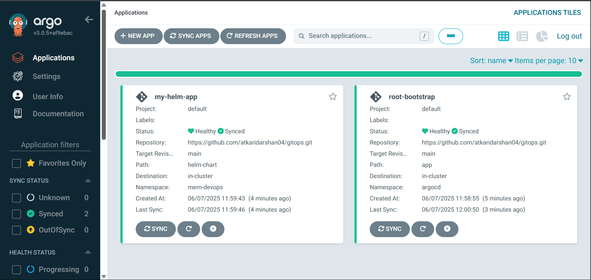

# 🚀 GitOps Deployment with ArgoCD & Helm

This project demonstrates a **GitOps pipeline** using ArgoCD and Helm. It follows the **"App of Apps"** pattern to manage and deploy Kubernetes workloads declaratively via Git.


## 🧱 Project Structure

```
.
├── argocd
│   └── helm-values.yml           # Custom values for installing ArgoCD via Helm (e.g. service type, RBAC, config)
│
├── bootstrap                     # GitOps bootstrap layer (App of Apps pattern)
│   ├── app
│   │   └── app.yml               # ArgoCD Application manifest that deploys your actual Helm chart from helm-chart/
│   └── root-app.yml             # Root ArgoCD Application that bootstraps all other apps from /bootstrap/app
│
├── helm-chart                    # Application Helm chart
│   ├── Chart.yaml                
│   ├── templates                 
│   └── values.yaml              
│
├── README.md
└── setup.md                      # Install Helm and Setup k8s cluster
```

## 🎯 What We're Doing (and Why)

| Component      | Purpose                                                                 |
|----------------|-------------------------------------------------------------------------|
| **Helm Chart** | Packages your app for reusable, parameterized Kubernetes deployment     |
| **ArgoCD**     | GitOps controller that keeps your cluster in sync with your Git repo    |
| **Bootstrap**  | Central repo/folder that defines _what_ ArgoCD should manage and deploy |


## 🚀 Setup Instructions

> Install Helm and Setup k8s cluster [setup.md](./setup.md)

### 1. Install ArgoCD

You can install ArgoCD locally using Helm:

```bash
helm repo add argo https://argoproj.github.io/argo-helm
helm install argocd argo/argo-cd -n argocd --create-namespace -f helm-values.yaml
````

> ⚠️ Use `NodePort` service for local access (`helm-values.yaml` should reflect this)

### 2. Access ArgoCD UI

```bash
kubectl -n argocd get svc argocd-server
```

Open in browser at:
**[http://localhost](http://localhost):30080**

Get initial password:

```bash
kubectl -n argocd get secret argocd-initial-admin-secret -o jsonpath="{.data.password}" | base64 -d
```

---

### 3. Deploy the Root ArgoCD Application

This `root-app.yaml` will deploy all apps defined in the `bootstrap/apps/` folder.

```bash
kubectl apply -f bootstrap/root-app.yaml
```

> ArgoCD will now auto-sync and deploy your Helm-based app!

### 4. Verify the Deployments
Go to Argo Dashboard verify deployments



Also check using 
```bash
kubectl get all -n mern-devops
```


## 🔄 Updating the App

* Commit changes to your Helm chart or `values.yaml`
* Push to Git
* ArgoCD will detect the change and **automatically sync**

You can also manually sync in the ArgoCD UI if automation is turned off.

---